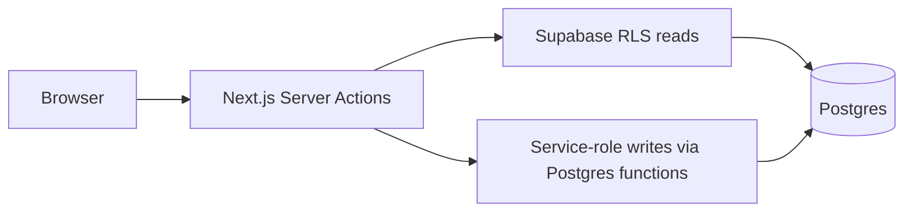

# Community Library

## Pitch

A small, secure library app for browsing books, requesting loans, and managing circulation.

## Tech stack

- Next.js App Router and Server Actions
- TypeScript with strict checking
- Tailwind CSS
- Supabase Postgres, Auth, RLS, and SQL functions
- Zod validation and Vitest tests
- Vercel deployment

## Architecture

## Features

- Member and librarian roles with protected Server Actions.
- Catalogue search, category filtering, and pagination.
- Member requests, cancellations, current loans, loan history, and fines.
- Librarian book management, issue workflow, and read-only dashboard.
- Open Library book covers with a graceful missing-cover fallback.
- Postgres-backed rate limits for authentication and writes.
- Calendar-date loan rules, atomic copy counters, and RLS-backed reads.

## Decisions

- Supabase provides hosted Postgres, Auth, RLS, and SQL functions without
  adding a separate backend service.
- Calendar dates avoid timezone surprises for due dates and fines. The
  library timezone is `Asia/Kolkata`.
- Atomic SQL functions protect copy counters and loan transitions from
  concurrent requests.
- Business rules live in [`src/lib/rules`](./src/lib/rules) and
  [`src/config/library-rules.ts`](./src/config/library-rules.ts).

## Security decisions

- Signed-in Supabase SSR clients enforce RLS for reads.
- Service-role writes are used only after Server Actions re-check
  authentication, role, ownership, and validated input.
- Roles come from `profiles`, never client input or user metadata.
- Authentication uses `auth.getUser()`, and login errors are generic.
- Redirect targets are restricted to same-site paths.
- Required security headers deny MIME sniffing, framing, camera,
  microphone, and geolocation. Content Security Policy is intentionally not
  built.
- Login and registration rate limits fail closed; lending and librarian
  writes fail open when the limiter is unavailable.

## Legacy gaps fixed

- G1: members can cancel pending requests.
- G3: copy counters and loan transitions are atomic.
- G6: password minimum length is validated.
- G7/G8: authenticated sessions and Server Action origin protections are used.
- G11: catalogue, history, and issue views have pagination.

## Run locally

1. Install dependencies with `npm install`.
2. Copy [`.env.example`](./.env.example) to `.env.local` and fill in the
   Supabase values.
3. Apply the migrations in
   [`supabase/migrations`](./supabase/migrations) in numeric order.
4. Run `npm run db:seed` for labelled demo data.
5. Start the app with `npm run dev`.

## Deploy to Vercel

1. Import the repository into Vercel.
2. Set these environment variables for the deployment:
   - `NEXT_PUBLIC_SUPABASE_URL`
   - `NEXT_PUBLIC_SUPABASE_ANON_KEY`
   - `NEXT_PUBLIC_DEMO_MODE`
   - `SUPABASE_SERVICE_ROLE_KEY`
3. Apply all Supabase migrations before opening the deployment.
4. Set the Supabase Auth site URL and redirect URLs to the Vercel URL.

`RESEND_API_KEY` and `CRON_SECRET` were removed because email reminders and
cron jobs are not implemented or used.

## Screenshots

TODO: add screenshots.

## Live demo

TODO: add the deployed URL.

## Lighthouse

to be filled with measured numbers

## Future work

The following are intentionally not built:

- Rate limiting improvements beyond the current database limiter
- Content-Security-Policy
- AI search
- Email reminders
- Browser end-to-end tests

## Demo credentials

These credentials are for local demo data only:

- Librarian: `librarian@demo.library.test` / `LibraryDemo123!`
- Member: `member@demo.library.test` / `LibraryDemo123!`
